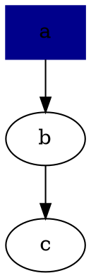

### Modules

#### Syntax

```
use (
  module_a
  module_b
)
```

#### How modules are found

1. Try to find the file: `${module_name}.sn` in the Current Directory.
2. Try to find in the `SANE_PATH` env variable in the order of paths listed there

#### TODO
* Directories for modules
* Relative search



